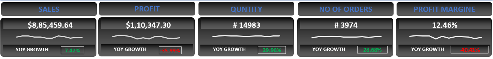

# ECOMMERS SALES ANALYSIS

# Introduction

This project aims to analyze and visualize the sales data of an e-commerce company to gain insights into customer behavior, sales performance, and market trends. The analysis is conducted using Microsoft Excel, focusing on transforming raw, unstructured data into actionable insights that can inform decision-making and strategy.

# Problem Statements

1. Sales Performance: How is the overall sales performance of the e-commerce company? What are the total sales, profit, and average order values?

2. Product Analysis: Which products and categories are performing well? What are the top-selling products and categories?

3. Customer Insights: Who are the key customer segments? What is the customer distribution by region, and how does it affect sales?

4. Time-based Analysis: What are the sales trends over time? Are there any noticeable seasonal trends or patterns?

# Dataset

This is dami data.  
Format of dataset file is csv file cantain 1,13,270 rows and 21 colums.

# Tools

Microsoft Excel: For data cleaning, transformation, analysis, and visualization.

# Analysis & Visualization

## Data Cleaning and Preparation

- Data Conversion: Unstructured data was converted into a tabular format using Excel, and additional fields were created for deeper analysis.

- Missing Values: There were no missing values in the dataset, ensuring data completeness.

### Key Metrics Calculation

Using Excel, we calculated the following key metrics:

- Total Sales: $23,163,662.56
- Average Order Value (AOV): $204.50
- Total Profit: $2,613,068.89
- Number of Orders: 113,270
- Average Discount: $21.11
- Total Quantity Sold: 222,866

### Exploratory Data Analysis (EDA)

#### Sales by Category

1. Pivot Table:

- Insert a PivotTable from the dataset.
- Drag category_name to Rows.
- Drag sales_per_order to Values and set it to Sum.
- This will give you total sales by category.

2. Chart:

- Create a bar chart from the PivotTable to visualize sales by category.

#### Sales by Region

1. Pivot Table:

- Insert another PivotTable.
- Drag customer_region to Rows.
- Drag sales_per_order to Values and set it to Sum.
- This will give you total sales by region.

2. Chart:

- Create a bar chart from the PivotTable to visualize sales by region.

#### Sales Trends Over Time

1. Pivot Table:

- Insert another PivotTable.
- Drag order_date to Rows and group by Month/Year.
- Drag sales_per_order to Values and set it to Sum.
- This will give you total sales by month/year.

2. Chart:

- Create a line chart from the PivotTable to visualize sales trends over time.

#### Top-Selling Products

1. Pivot Table:

- Insert another PivotTable.
- Drag product_name to Rows.
- Drag sales_per_order to Values and set it to Sum.
- Sort the PivotTable by the Sum of sales_per_order in descending order to identify   top-selling products.

2. Chart:

- Create a bar chart from the PivotTable to visualize the top-selling products.

And so on..........

# Conclusion

## The analysis provided the following key insights:

### High-Performing Categories 
Identified product categories that contribute the most to total sales, helping to focus marketing and inventory efforts.

### Regional Sales Performance 
Recognized regions that generate the highest sales, informing regional promotions and inventory adjustments.

### Sales Seasonality
Understood seasonal trends in sales, enabling better planning for inventory and marketing strategies.

### Product Performance
Highlighted top-selling products, ensuring they are adequately stocked and promoted.

# Recommendations

### Enhance Marketing Efforts
 Focus on high-performing categories and regions to maximize sales and profitability.

### Optimize Inventory Management
Use sales trends and top-selling product data to ensure popular items are always in stock.

### Leverage Seasonal Trends
Plan marketing campaigns and promotions around identified seasonal peaks to boost sales.

### Improve Customer Engagement
Tailor marketing strategies to key customer segments based on regional and demographic data.
